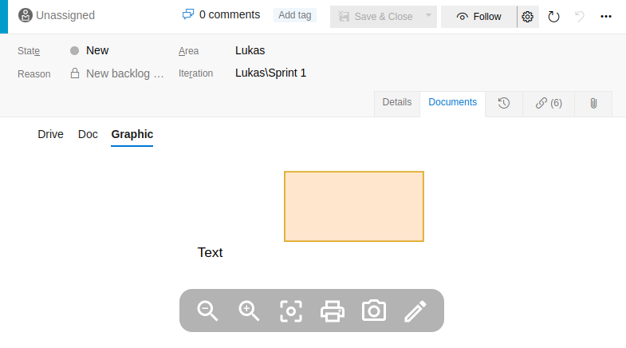

# Azure DevOps - Work Item Documents Viewer extension

With this extension you can display linked documents in work items. All relations of the type "Hyperlink" are embedded into a new tab "Documents" on the work item form. Depending on the content, an optimized visualisation is selected.

[ [Azure DevOps - Marketplace Extension](https://marketplace.visualstudio.com/items?itemName=lukaswoehrl.azdo-workitem-documents) ]

### Supported optimizations

- Google Documents (Embedded mode for Docs, Sheets, Slides, etc.)
- Google Drive (Displayed as list)
- [diagrams.net/draw.io](https://app.diagrams.net/) (Viewer mode)

### Screenshot

### Attributions

- [Document icons created by Driss Lebbat - Flaticon](https://www.flaticon.com/free-icons/document)