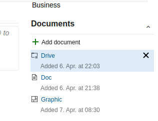

# Azure DevOps - Work Item Documents Viewer extension

Would you like to view all documents of a work item without opening several new tabs? This extension will display all linked documents in a tab next to the work item. Cool, huh? 🤩

### How?

The most simple way to add documents is to add them via the _Add Document_ button in the work item form.

All relations of the type _Hyperlink_ are embedded into a new tab _Documents_ on the work item form. Depending on the URL, an optimized visualization is displayed so that you can perform actions directly.

The comment of the _Hyperlink_ is used as the title of the tab.

Additionaly, referenced document urls in the _Description_ field are extracted and embedded, too.

### Supported optimizations

- Google Documents (Embedded mode for Docs, Sheets, Slides, etc.)
- Google Drive (Displayed as list)
- [diagrams.net/draw.io](https://app.diagrams.net/) (Viewer mode)

_If you have additional ideas, please create an [issue](https://github.com/woehrl01/azdo-workitem-documents-extension/issues)._

### Screenshot

#### Embedded documents zab

#### Work item form group to display documents as a list

#### Dialog to quickly add new documents

---

### FAQ

#### How can I hide the tab or group from specific work item types?

You can hide the tab or group by [modifing your process](https://docs.microsoft.com/en-us/azure/devops/organizations/settings/work/customize-process-form?view=azure-devops). Use _Hide from layout_ on the specific work item type.

#### Why are some documents, referenced in _Description_, not shown?

To reduce clutter and embedding incompatible documents, we only crawl for supported documents inside the _Description_ field. If you still want to embed them, add them via a _Hyperlink_ relation.

If you want to generally allow these kind of documents, specify an _Allow rule_ in the settings.

#### Why are some documents, defined via an _Allow rule_, not shown?

To ensure proper rendering inside an iframe, the extension requires that the URI needs to match the https scheme. If you think this should be changed, please let me know.

---

In some scenarios, this extension might be treated as a must-have feature. I hope that it will be useful for you and your team. The extension is available on the [Azure DevOps Marketplace](https://marketplace.visualstudio.com/items?itemName=lukaswoehrl.azdo-workitem-documents) and on [GitHub](https://github.com/woehrl01/azdo-workitem-documents-extension) under MIT license!

---
_This extension uses Application Insights for telemetry._

_[Document icons created by Driss Lebbat - Flaticon](https://www.flaticon.com/free-icons/document)_
_[Cancel icons created by Freepik - Flaticon](https://www.flaticon.com/free-icons/cancel)_
